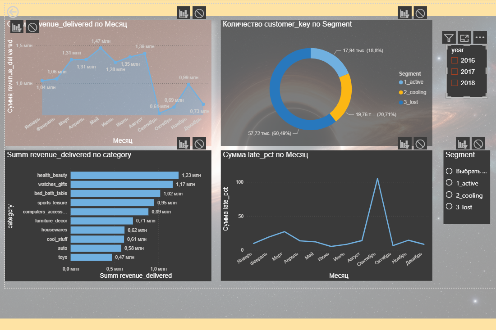

# ecommerce-dwh

End-to-end ETL / Data Warehouse pipeline built on the Olist Brazilian
E-Commerce public dataset (Kaggle, ~100k orders, 2016-2018).

Raw CSV files and a REST API are loaded into PostgreSQL, cleaned and
modeled into a star schema, and visualized in Power BI.

## Stack

PostgreSQL 17, Python, Docker, DBeaver, Power BI Desktop, Git

## Architecture

raw -> data loaded as-is, no transformation, all columns text
stg -> typed, deduplicated, quality-flagged
core -> star schema: dimensions and facts
mart -> pre-aggregated views for BI, no joins required

Design decisions are documented in [`docs/decisions.md`](docs/decisions.md).
Data quality issues found during profiling are logged in
[`docs/known_defects.md`](docs/known_defects.md).
Metric definitions are fixed in [`docs/metrics.md`](docs/metrics.md)
before any dashboard code was written.

## Dashboard

Built on three mart-layer views:

- `mart.sales_daily` - revenue and orders by date and category
- `mart.customer_rfm` - customer segmentation (Recency, Frequency, Monetary)
- `mart.delivery_performance` - delivery time and late-delivery rate by month

## Key findings

- **Two customer identifiers in the source data.** `customer_id` is unique
  per order, `customer_unique_id` is the real person. Using the wrong one
  gives 0% retention instead of the real 3.1%. See `known_defects.md`.
- **~2% of order value silently disappears** on a naive INNER JOIN between
  order items and the category translation table. Fixed with LEFT JOIN
  and an explicit `undefined` category bucket.
- **Delivery delays spike in Nov 2017 and Feb-Mar 2018**, correlating with
  order volume peaks (Black Friday and a subsequent period), visible in
  `mart.delivery_performance`.

## Quick start

cp .env.example .env
docker compose up -d
python -m src.extract <filename>.csv

SQL for each layer is in `sql/stg`, `sql/core`, `sql/mart`, in build order.

| Service | Address |
|---|---|
| PostgreSQL | localhost:5432 |
| Jupyter | http://localhost:8888 |

## Progress

- [x] Day 1 - environment
- [x] Day 2 - extract
- [x] Day 3 - data profiling
- [x] Day 4 - staging layer
- [x] Day 5 - core layer (star schema)
- [x] Day 6 - mart layer + metric definitions
- [x] Day 7 - Power BI dashboard
- [ ] Day 8 - refactoring, tests, logging
- [ ] Day 9 - data quality checks, pipeline_runs audit table
- [ ] Day 10 - idempotency, incremental load, SCD2
- [ ] Day 11-12 - Airflow orchestration
- [ ] Day 13 - Docker polish, CI
- [ ] Day 14 - final documentation